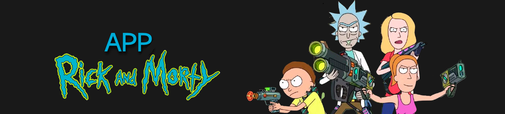
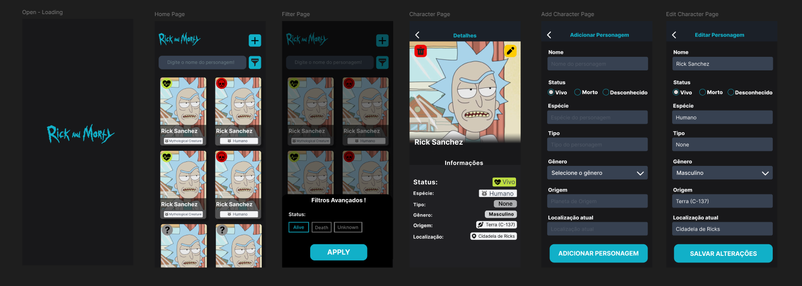

<h1 align="center">App Rick and Morty</h1>
<!-- Badges -->
<p align="center">

[](https://github.com/eduardogsouz/desafio-gestao-boa/blob/main/LICENSE)
[](https://github.com/eduardogsouz/desafio-gestao-boa/commits/main)
[](https://www.linkedin.com/in/eduardo-goncalves-souza/)
[](https://github.com/eduardogsouz/desafio-gestao-boa)

</p>



O objetivo dessa aplicação é fornecer um guia sobre os personagens do desenho 'Rick and Morty' lançado em 2013, pela Adult Swim, que acompanha as malucas viagens no tempo-espaço e por universos paralelos de Rick, um cientista com problemas com a bebida, e seu neto Morty, um adolescente não tão brilhante quanto o avô.

Eu criei um Design completo da aplicação através do Figma: **[Link Figma](https://www.figma.com/design/mtKJxbaQYG1PUHT1VxAylm/Rick-and-Morty-Api?node-id=0-1&t=B2bO4YEW9ne4Polh-1)**, vale ressaltar que algumas páginas foram modificadas conforme o desenvolvimento.



## Como a aplicação funciona?

O app deve apresentar todos os personagens da série e permitir um filtro por nome, e se está vivo ou morto, e clicando em um específico, devem aparecer as informações como: nome, localização, origem, raça, entre outros...

## Funcionalidades?

- [x] Tela de loading, para carregar os dados da api;
- [x] Scroll infinito de todos os personagens;
- [x] Reload para voltar para o inicio dos personagens;
- [x] Filtro de personagens;
- [x] Navegação entre telas;
- [x] Adição, Remoção e exclusão de personagens;
- [x] Trazer as informações do personagem;

## 🛠 Tecnologias utilizadas

Para o desenvolvimento deste site utilizei as seguintes tecnologias:

- Typescript;
- React-Native;
- Expo;

## 🚀 Como testar a aplicação

```bash
# Clone o repositório
git clone https://github.com/JoyceQuerubino/desafio-mobile-superlogica.git

# Instale as dependências
npm install

# Execute o script
npx expo start

# O projeto inciará através do Expo Go, um QR Code estará disponível.

#Caso tenha o "Android Studio" instalado no computador em vez do expo start coloque:
npx expo run:android
------------------------------------------------------------------
Para usar a aplicação pelo Expo Go
- Baixe o aplicativo 'Expo Go' no seu celular
- Clique em 'Scan QR Code' para escanear o QR code gerado!
-------------------------------------------------------------------


```

<p align= center>
Desenvolvido por <strong>Eduardo Gonçalves Souza</strong>   -----  <a href="www.linkedin.com/in/eduardo-goncalves-souza/"target="_blank">Linkedin</a>
</p>
